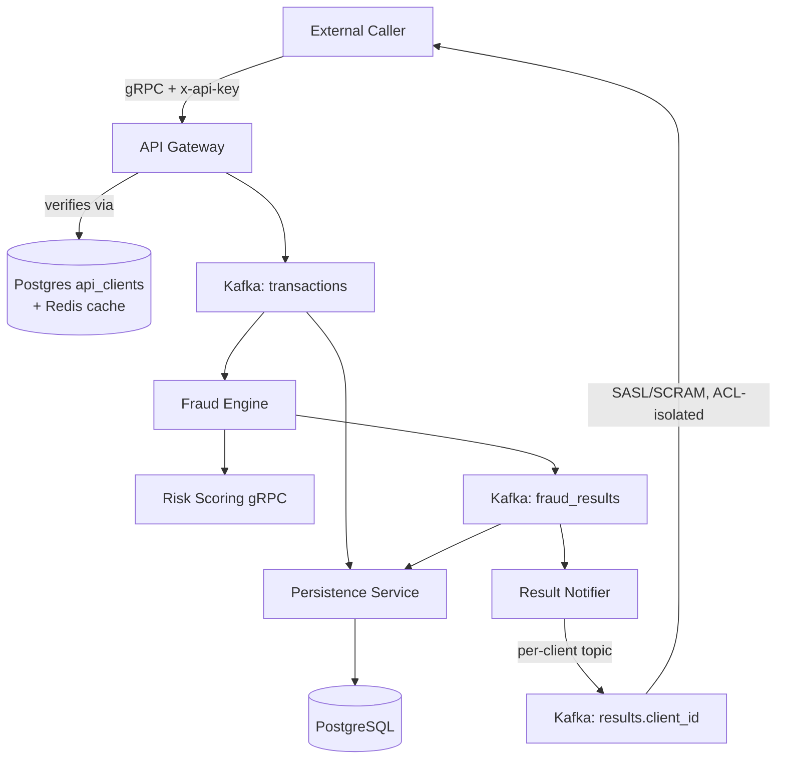

# SentinelSwitch


SentinelSwitch is a distributed, event-driven payment transaction and fraud monitoring platform built using Go.
It simulates a real-world payment switch architecture using Kafka, gRPC, PostgreSQL, Redis, Prometheus, and Grafana, and exposes itself as a multi-tenant product — any authenticated external caller can submit transactions and receive their own fraud decisions back, isolated from every other caller.

This project demonstrates scalable microservice architecture, real-time fraud scoring, async processing, multi-tenant API design, and production-grade observability.

## ✨ Highlights

- **5 independent Go microservices** communicating over Kafka (async) and gRPC (sync)
- **Real-time fraud detection**: rule-based checks + Redis-backed velocity scoring + risk-scoring gRPC call, all under ~seconds of latency
- **API-key authentication**: every gRPC call is verified against a Postgres-backed client registry (Redis-cached), fails **closed** on any backing-store error — never silently admits unauthenticated traffic
- **Multi-tenant result delivery**: each external caller gets a dedicated, SASL/SCRAM-authenticated Kafka topic (`results.<client_id>`) for their own fraud decisions — broker-enforced ACLs mean no caller can read another's data
- **Resilience patterns**: circuit breaker for downstream gRPC calls, dead-letter queues for failed DB writes *and* unroutable results, idempotency via Redis
- **Full observability**: Prometheus metrics per service (all 5 scraped), Grafana dashboards for TPS, fraud ratio, latency, and consumer lag
- **Liveness + readiness health checks**: `/healthz` (process is up) and `/readyz` (real dependencies — Postgres/Redis/etc. — are actually reachable) on every service
- **Per-service rotating file logs**: each service logs everything to its own hourly-rotated file tree; the terminal only shows output during startup, so it stays readable during manual testing

---

## 🧠 Architecture Overview



All services expose Prometheus metrics → scraped by Prometheus → visualized in Grafana.

---

## 🧩 Tech Stack

| Component        | Technology Used |
|------------------|-----------------|
| Language         | Go (Golang)     |
| API Layer        | gRPC (Protocol Buffers) |
| Messaging        | Apache Kafka (multi-listener: plaintext internal + SASL/SCRAM external) |
| RPC              | gRPC            |
| Database         | PostgreSQL      |
| Cache            | Redis           |
| Metrics          | Prometheus      |
| Visualization    | Grafana         |
| Containerization | Docker — `docker compose up -d` brings up the full stack: infra + all 5 app services, each built from its own Dockerfile (repo root build context, see below) |

---

## 🧱 Microservices

| # | Service | Role | Default ports |
|---|---|---|---|
| 1️⃣ | **API Gateway** | Authenticates callers (`x-api-key`), validates + hashes card data, checks idempotency, publishes to Kafka, returns immediate ACK; `GetTransactionStatus` polls the final decision, scoped to the caller's own `client_id` | gRPC `50051` · metrics `9091` · health `8081` |
| 2️⃣ | **Fraud Engine** | Consumes transactions, runs rule-based + velocity fraud checks, calls Risk Service, publishes fraud results | metrics `9095` · health `8082` |
| 3️⃣ | **Risk Service** | gRPC service computing a weighted risk score (100–1000) from the fraud feature vector | gRPC `50052` · metrics `9094` · health `8084` |
| 4️⃣ | **Persistence Service** | Consumes fraud results, upserts into partitioned PostgreSQL tables, DLQs on failure | metrics `9093` · health `8083` |
| 5️⃣ | **Result Notifier** | Consumes fraud results and republishes each one, unmodified, to that caller's private `results.<client_id>` topic; unroutable results go to `results_unrouted_dlq` | metrics `9098` · health `8085` |

---

## 🔐 Multi-Tenant Access & Result Delivery

SentinelSwitch is built to work as an independent product for any external integrator, not just a fixed set of known clients:

1. **Authentication** — every `SubmitTransaction` call must carry an `x-api-key` header. The API Gateway hashes it and looks it up against a Postgres `api_clients` registry (Redis-cached, 60 s TTL). A backing-store outage returns `UNAVAILABLE` — it never falls back to admitting the request.
2. **Identity propagation** — the verified `client_id` (distinct from `merchant_id`, which identifies who the transaction is *for*) rides through `TransactionEvent` → `FraudResultEvent` untouched, so the final result always knows who it belongs to.
3. **Isolated delivery** — Result Notifier republishes each `FraudResultEvent` to a dedicated `results.<client_id>` Kafka topic on a SASL/SCRAM-authenticated listener (`localhost:9096` in dev). Broker ACLs restrict each client's credentials to only their own topic and a `<client_id>.`-prefixed consumer-group namespace.
4. **Onboarding** — new clients are provisioned via `AdminService.ProvisionClient`, an admin-key-gated gRPC RPC on API Gateway (`x-admin-key` metadata, separate from any client's `x-api-key`). It creates the Postgres row, the Kafka SCRAM credential, the dedicated topic, and both ACLs in one call, and returns the API key and SCRAM password once. `scripts/provision-client.sh <client_id> <name>` does the same four steps by hand via `docker exec` and remains as a break-glass path for when the API Gateway itself is down.

Full design + verified test results: [docs/MULTI_TENANT_RESULT_DELIVERY.md](docs/MULTI_TENANT_RESULT_DELIVERY.md).
Full request/response field reference for every RPC (including `ProvisionClient` above):
[docs/API_SPEC.md](docs/API_SPEC.md).

**Demo tooling** (`scripts/demo/`): `decode-results` is a CLI that decodes a client's raw Kafka messages into readable JSON; `live-dashboard` is a local web page that streams a client's incoming fraud decisions in real time — built for showing "submit a transaction → decision arrives on your own private channel" to a non-technical audience without exposing gRPC/Kafka internals.

---

## 📊 Observability

Each service exports Prometheus metrics on its own `/metrics` endpoint, for example:

- `sentinel_risk_requests_total`, `sentinel_risk_score_histogram` — Risk Service
- `fraud_engine_messages_processed_total`, `fraud_engine_processing_duration_seconds`, `fraud_engine_risk_call_errors_total` — Fraud Engine
- `sentinel_persistence_upserts_total`, `sentinel_persistence_batch_size_histogram` — Persistence Service
- `sentinel_result_notifier_messages_routed_total`, `sentinel_result_notifier_unrouted_total` — Result Notifier (not labeled by `client_id` — unbounded cardinality risk)

Prometheus scrapes metrics. Grafana dashboards visualize TPS, fraud detection ratio, gRPC latency, consumer lag, and DB write throughput.

---

## 🐳 Running Locally

### 1️⃣ Clone the repository

```bash
git clone https://github.com/gobi722/sentinelswitch.git
cd sentinelswitch
```

### 2️⃣ Start everything

Docker Compose brings up the full stack in dependency order: infrastructure — Kafka (3 listeners: internal, external, and a SASL/SCRAM public listener for external result delivery), Zookeeper, Schema Registry, Redis, PostgreSQL, Prometheus, Grafana — followed by all 5 app services (API Gateway, Fraud Engine, Risk Service, Persistence Service, Result Notifier), each built from its own `Dockerfile` and wired to the others via compose service DNS names:

```bash
docker compose up -d
```

Secrets (`PAN_HASH_SECRET`, `POSTGRES_PASSWORD`) are read from a root-level `.env` file, which is gitignored and not committed — create one locally before first run:

```bash
# .env (repo root)
PAN_HASH_SECRET=dev_pan_hash_secret_for_testing
POSTGRES_PASSWORD=sentinel_local_secret
ADMIN_API_KEY=dev_admin_key_for_testing   # gates AdminService.ProvisionClient — see step 5
```

Check everything came up healthy:

```bash
docker compose ps
```

### 3️⃣ Generate protobuf code

Only needed if you've changed a `.proto` file — regenerate before rebuilding any image that depends on it:

```bash
buf generate
```

### 4️⃣ Rebuild a service after a code change

```bash
docker compose up --build -d fraud-engine   # rebuilds + restarts just that service
```

For env-only changes (no code/config edits), skip `--build` — `docker compose up -d fraud-engine` alone recreates the container with the new environment (`docker compose restart` does **not** pick up env changes, since it reuses the existing container).

> **Iterating on a single service outside Docker** (faster inner loop, no image rebuild) is still possible — run it as a bare Go binary from its own service directory, since config paths are relative to it, not to `cmd/`:
> ```bash
> cd services/fraud-engine && go run ./cmd
> ```
> Each service loads a `.env` from its own directory via `godotenv` if present. Point it at the Compose-published infra ports (`localhost:9092`, `localhost:5432`, etc.) rather than running the whole stack via Compose at the same time.

Every service logs everything to an hourly-rotated file tree at `logs/<service>/YYYY/MM/DD/HH.log` (repo root); the terminal only shows output while the service is starting up, then goes quiet.

### 5️⃣ Provision a client and call the API

Via the admin gRPC API (`AdminService.ProvisionClient`, requires `x-admin-key`):

```bash
grpcurl -plaintext \
  -H "x-admin-key: dev_admin_key_for_testing" \
  -d '{"client_id": "my-test-client", "display_name": "My Test Integrator"}' \
  localhost:50051 \
  sentinel.gateway.v1.AdminService/ProvisionClient
```

Or via the equivalent CLI script (useful when the API Gateway itself is down but Postgres/Kafka are reachable directly):

```bash
scripts/provision-client.sh my-test-client "My Test Integrator"
```

Either path prints an API key (for `x-api-key` on `SubmitTransaction`) and SCRAM credentials (for consuming `results.my-test-client`) — see [Multi-Tenant Access & Result Delivery](#-multi-tenant-access--result-delivery) above.

### 6️⃣ Build a single image manually (optional)

Each service has a working `Dockerfile`, but the build context must be the **repo root** (not the service directory) — the `go.mod` replace directive and each service's default config path both reach outside `services/<name>/`:

```bash
docker build -f services/api-gateway/Dockerfile -t sentinel-api-gateway .
```

Swap the service name in both places for the other 4. Compose already builds and runs all 5 (step 2) — this is only useful for inspecting a single image in isolation.

> For full setup steps (environment variables, ports, health checks, and troubleshooting), see [docs/INFRASTRUCTURE_SETUP.md](docs/INFRASTRUCTURE_SETUP.md).