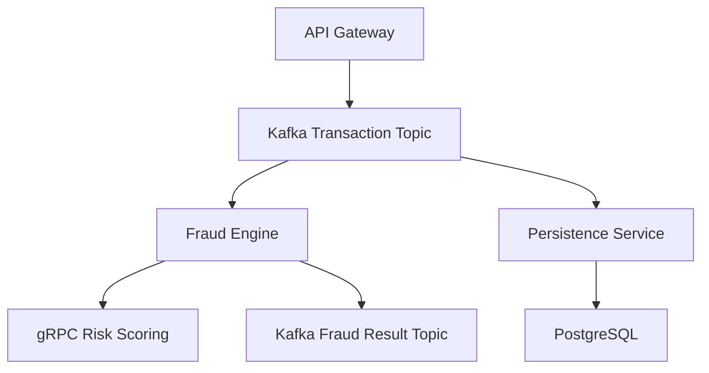

# SentinelSwitch


SentinelSwitch is a distributed, event-driven payment transaction and fraud monitoring platform built using Go.  
It simulates a real-world payment switch architecture using Kafka, gRPC, PostgreSQL, Redis, Prometheus, Grafana, Docker, and Kubernetes.

This project demonstrates scalable microservice architecture, real-time fraud scoring, async processing, and production-grade observability.

## ✨ Highlights

- **4 independent Go microservices** communicating over Kafka (async) and gRPC (sync)
- **Real-time fraud detection**: rule-based checks + Redis-backed velocity scoring + risk-scoring gRPC call, all under ~seconds of latency
- **Resilience patterns**: circuit breaker for downstream gRPC calls, dead-letter queue for failed DB writes, idempotency via Redis
- **Full observability**: Prometheus metrics per service, Grafana dashboards for TPS, fraud ratio, latency, and consumer lag

---

## 🧠 Architecture Overview



All services expose Prometheus metrics → scraped by Prometheus → visualized in Grafana

---

## 🧩 Tech Stack

| Component        | Technology Used |
|------------------|-----------------|
| Language         | Go (Golang)     |
| API Layer        | gRPC (Protocol Buffers) |
| Messaging        | Apache Kafka    |
| RPC              | gRPC            |
| Database         | PostgreSQL      |
| Cache            | Redis           |
| Metrics          | Prometheus      |
| Visualization    | Grafana         |
| Containerization | Docker          |
| Orchestration    | Kubernetes      |

---

## 🧱 Microservices

### 1️⃣ API Gateway
- Accepts transaction requests
- Publishes to Kafka
- Returns immediate acknowledgement
- Exposes Prometheus metrics

### 2️⃣ Fraud Engine Service
- Consumes transactions from Kafka
- Performs rule-based + velocity fraud checks
- Calls Risk Scoring service via gRPC
- Publishes fraud result to Kafka

### 3️⃣ Risk Scoring Service
- gRPC-based microservice
- Calculates risk score (100–1000)
- Simulates ML model scoring

### 4️⃣ Persistence Service
- Consumes transaction + fraud results
- Stores into PostgreSQL
- Maintains partitioned transaction tables

---

## 📊 Observability

Each service exports Prometheus metrics on its own `/metrics` endpoint, for example:

- `sentinel_risk_requests_total`, `sentinel_risk_score_histogram` — Risk Scoring Service
- `fraud_engine_messages_processed_total`, `fraud_engine_processing_duration_seconds`, `fraud_engine_risk_call_errors_total` — Fraud Engine
- `sentinel_persistence_upserts_total`, `sentinel_persistence_batch_size_histogram` — Persistence Service

Prometheus scrapes metrics.
Grafana dashboards visualize:

- TPS (Transactions per second)
- Fraud detection ratio
- gRPC latency
- Consumer lag
- DB write throughput

---

## 🐳 Running Locally

### 1️⃣ Clone the repository

```bash
git clone https://github.com/gobi722/sentinelswitch.git
cd sentinelswitch
```

### 2️⃣ Start infrastructure

Docker Compose brings up Kafka, Zookeeper, Schema Registry, Redis, PostgreSQL, Prometheus, and Grafana:

```bash
docker compose up -d
```

### 3️⃣ Generate protobuf code

```bash
buf generate
```

### 4️⃣ Run the services

Each Go microservice runs as its own binary (in separate terminals):

```bash
cd services/risk-service     && go run ./cmd/main.go
cd services/fraud-engine     && go run ./cmd/main.go
cd services/api-gateway      && go run ./cmd/main.go
cd services/persistence-svc  && go run ./cmd/main.go
```

> For full setup steps (environment variables, ports, health checks, and troubleshooting), see [docs-mine/SERVICE_RUN_GUIDE.md](docs/INFRASTRUCTURE_SETUP.md).
